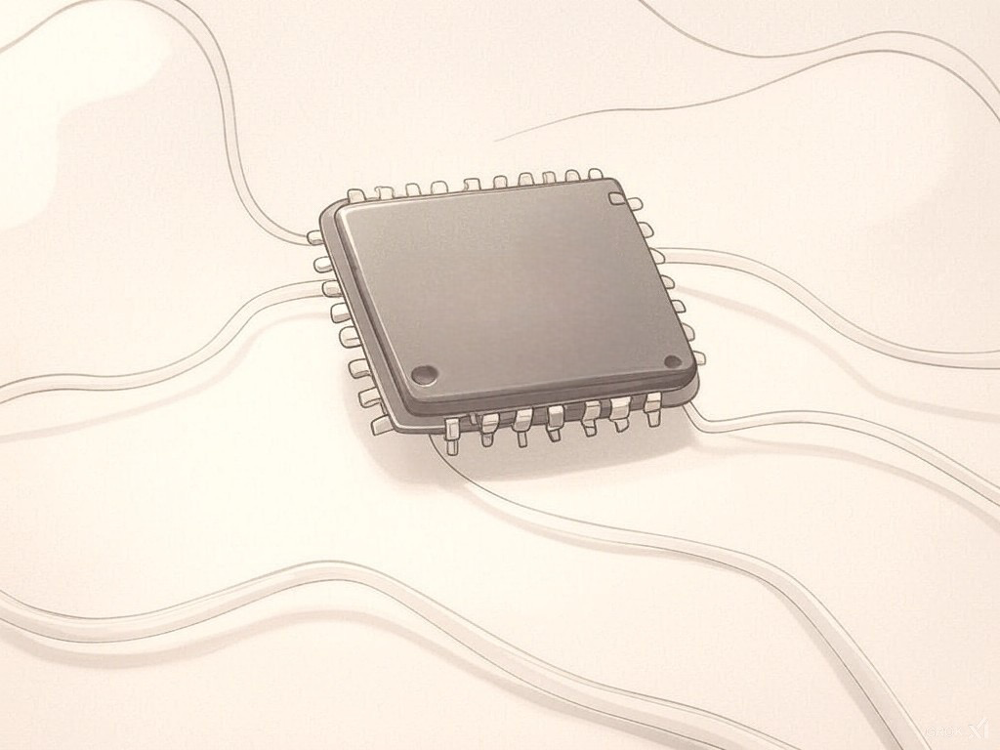

# Билдим, тестим, анализируем, плачем: CI/CD в embedded

# Содержание

1. Введение
2. Что такое CI/CD и какой он в embedded
3. Ключевые компоненты, без которых не обойтись
4. Практическое применение: Драйвер матричной клавиатуры
5. Заключение

# Введение

Я понимаю, что в большинстве случаев программист микроконтроллеров просто открывает проприетарную IDE, пишет код, отлаживает его, копирует .elf - и на этом все. Проект завершён, можно забыть. 

Но такой подход плохо работает в долгосрочной перспективе. Если продукт **предполагает длительную поддержку и развитие**, или вы работаете в команде, где каждый день кто-то что-то меняет — без порядка не обойтись. Нужно постоянно проверять, не сломалось ли то, что раньше работало. А ещё — быстро находить ошибки, воспроизводить окружение, следить за качеством кода и поддерживать стабильность релизов.

И вот здесь может помочь внедрение CI/CD. Понимаю, что для многих идея автоматической сборки, тестирования (Tесты? Серьёзно?) и релизов в контексте embedded звучит странно. Зачем всё это, если "у меня на компьютере всё собирается" ?

Ответ простой: именно чтобы оно всегда и везде собиралось. И не только у тебя.
CI/CD в embedded — это не роскошь.

# Что такое CI/CD и какой он в embedded

CI/CD — это методология и набор практик, которые автоматизируют процессы разработки, тестирования и доставки ПО. Я рассматриваю CI/CD скорее как философию — позволяет быстро и с минимальными болями интегрировать новый код и проверять, что ничего не сломалось.
Простыми словами, мы все люди, и мы можем ошибаться. Но у нас есть помощник, который за всем проследит, сделает рутинные задачи за нас, подскажет, где косяк, и найдет того, кто пихает жуков.

 Основные компоненты:

- **CI (Continuous Integration)** — непрерывная интеграция. Позволяет быстро объединять изменения в коде, не боясь, что что-то развалится. Перед тем как код попадет в основную ветку, он проходит тестирование, проверку стиля и другие проверки.
- **CD (Continuous Delivery/Continuous Deployment)** — код автоматически готовится к развертыванию. Я думаю в нашем embedded-мире это чаще **Continuous Delivery** — генерим прошивку и загружаем на сервер для OTA или прошивки через программатор.

Основа всего — **конвейер (pipeline)**. Это последовательность автоматических шагов (**job'ов**), которые запускаются при каждом коммите, pull request'е или по расписанию. **Job** — это просто набор консольных команд, которые что-то делают.

Покажу примеры конвейеров, которые использую в своих проектах:

- В **develop-ветке** — анализ кода, тесты и проверка, что ничего не сломалось. Цель — поймать ошибки как можно раньше.
- В **release-ветке** — финальные проверки, сборка стабильной версии и публикация релиза.

Pipeline выбирается в зависимости от ветки, куда внесли изменения. Оба включают несколько этапов: **сборка, анализ кода, тестирование, метрики и развертывание**. Разберем их подробнее:

### **1. Этап сборки (Build stage)**

На этом этапе исходный код компилируется в исполняемый файл, готовый для тестирования и развертывания.

Обычно использую один **job** с необходимым компилятором. Однако, если проект поддерживает несколько платформ или конфигураций (например, отдельные сборки для **bootloader** и **основной прошивки**), pipeline может включать несколько **job'ов**, чтобы обеспечить совместимость и корректную сборку для каждой из них.

### **2. Этап анализа (Analyze stage)**

Здесь проверяю, что код написан по-человечески. Честно говоря, без этого этапа очень легко наделать глупых ошибок, которые потом будешь искать часами.  Я обычно включаю:

- **Статические анализаторы**: **CppCheck** — найдет то, что глаз не заметил
- **Проверка стандартов**: **MISRA**, **AUTOSAR** — если проект серьезный и требует соответствия
- **Форматирование**: **clang-format** — чтобы код выглядел единообразно, а не как каша

### **3. Этап тестирования (Test stage)**

Самый неоднозначный этап. Я понимаю, что мы работаем с железом, и многие скажут: «Как вообще можно что-то проверить?»

Hardware-зависимые части нужно выносить в отдельные модули и сводить к минимуму. А вот бизнес-логику можно и нужно тестировать, заменяя железные зависимости mock-объектами или эмуляторами. Уже есть хорошие готовые инструменты, которые облегчают жизнь:

- **Unity** (не игровой движок) и **Google Test** для юнит-тестов
- **Renode** — эмулятор, с которым я пока лично не работал, но выглядит крайне многообещающе

Понимаю, что у многих нет отдельных тестировщиков. Мы, разработчики, сами отвечаем за качество. И да, тесты — не панацея, они не решат абсолютно все проблемы. Но вот что они точно делают хорошо — помогают не сломать то, что уже работает, и быстро найти косяк, когда что-то пошло не так. 

Я пишу тесты только для модулей верхнего уровня и иногда для драйверов — считаю этого достаточно.

### **4. Этап метрик (Metric stage)**

Тут собираем данные о том, как дела с качеством и производительностью кода. Признаюсь, часто этим пренебрегаю, но когда настроишь — очень полезно.

Что можно отслеживать:

- **Сложность кода** (Cyclomatic complexity) — чтобы понимать, не слишком ли запутанно написали
- **Вклад разработчиков** (git-метрики) — кто сколько кода написал, полезно для аналитики

### **5. Этап развертывания (Deploy stage)**

Финишная прямая — создаем финальную сборку и публикуем её.

Тут может быть:

- **Формирование релиза** (я использую **SemVer** для версионирования)
- **Шифрование и подпись прошивки** — особенно важно для продакшена
- **Загрузка на сервер** — чтобы потом можно было обновить устройства

Теперь, когда мы разобрались с концепциями  **CI/CD**, **Pipeline** и **Job**, нужно остановится на том без чего не обойтись.

# Ключевые компоненты, без которых не обойтись

Для успешного внедрения CI/CD в embedded-разработку необходимы несколько основных компонентов:

### Система контроля версий: Git

Git — это основа всего. Без него не получится нормально управлять кодом, отслеживать изменения и понимать, когда запускать конвейер. Когда что-то ломается, Git позволяет быстро найти, кто что менял и в какой момент всё пошло коту под хвост.

Git отлично дружит с GitHub и GitLab — там можно не только хранить код, но и использовать встроенные CI/CD (GitHub Actions, GitLab CI).

Советую разобраться с **методологией GitFlow**. Звучит страшновато, но на деле всё просто — она помогает навести порядок в ветках. Есть **main** для того, что уже точно работает, **develop** для новых фишек, **feature** для разработки отдельных задач, **hotfix** для срочных исправлений. Когда у вас есть такая структура, настраивать CI/CD становится гораздо легче — вы точно знаете, какие проверки запускать для каждого типа веток.

### Инструменты для автоматической сборки

Чтобы код превратился в рабочую прошивку, его нужно **собрать**. И этот процесс должен быть автоматическим и не зависеть от настроек конкретного разработчика, IDE или операционки. Иначе получается классика — "у меня работает, а у тебя нет".

Что я использую:

- **CMake** — помогает создавать платформонезависимые скрипты сборки
- **Make, Ninja** — управляют процессом сборки, быстро и надежно

В рамках **CI/CD** критически важно, чтобы сборка была воспроизводимой. **CMake** обеспечивает предсказуемое поведение — каждый запуск даст одинаковый результат, где бы его ни запустили. Это позволяет без проблем интегрировать сборку в пайплайны.

### Окружение с полным набором инструментов и зависимостей

Для нормальной автоматизации нужно **предсказуемое и чистое окружение**. Чтобы сборка работала одинаково, где бы и кто бы её ни запускал.

Тут **Docker** просто спасение — создает изолированные контейнеры со всеми нужными инструментами, компиляторами и зависимостями. Решает проблему несоответствий между разными машинами и операционками. Теперь неважно, где запускается pipeline — он всегда отработает как надо.

Крутая фишка — этот же контейнер можно использовать для локальной разработки. Например, с **Dev Container** все разработчики работают в одинаковом окружении, забыв про "а у меня другая версия компилятора".

### Читаемость кода и его модульность

# Практическое применение: драйвер матричной клавиатуры

Возьмем небольшой пример, настроим конвейер для 

## Архитектура драйвера

Очень важно 

## Юнит-тесты

## **Docker-контейнер**

# Заключение

CI/CD в embedded — это не модная фишка, а практическая необходимость для серьезных проектов. Да, это требует времени на настройку и меняет привычный процесс разработки. Но результат стоит затраченных усилий.

Что вы получите:

- **Стабильность**: больше никаких "у меня работает, а в продакшене падает"
- **Скорость**: автоматизация рутинных задач освобождает время для решения интересных проблем
- **Качество**: постоянные проверки помогают поддерживать высокий уровень кода
- **Масштабируемость**: новые разработчики быстрее включаются в проект

Начинайте с малого — автоматизируйте сборку. Увидите результат — добавляйте проверки. Постепенно у вас сформируется надежный конвейер, который сделает разработку предсказуемой и приятной.

Помните: CI/CD — это не только технология, но и изменение процессов. Команда должна понимать, зачем это нужно, и привыкнуть к новому workflow.

Лучший CI/CD — тот, который работает в вашей команде с вашими проектами. Не копируйте чужие решения один в один. Адаптируйте, экспериментируйте и находите то, что подходит именно вам.